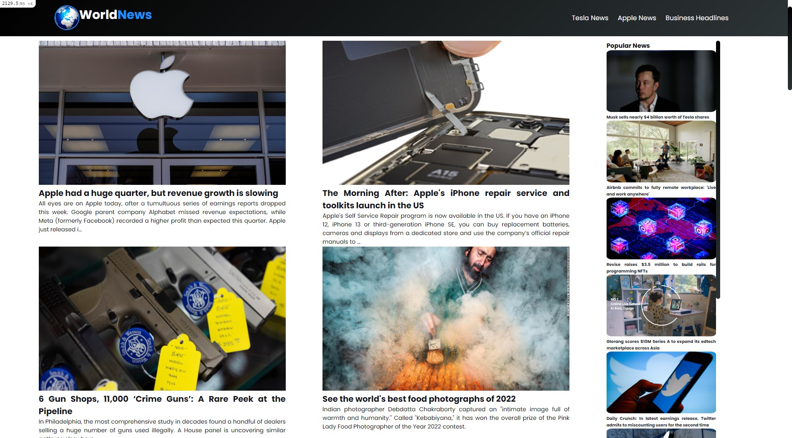

# Blog Website Api

This project created by ruby on rails and the api that I used is newsapi.org 
# API
<a href="https://newsapi.org/" target="_blank">NewsApi</a>
# Gem
```ruby
 gem 'rest-client'
```

Things you may want to cover:

* Ruby version

* System dependencies

* Configuration

* Database creation

* Database initialization

* How to run the test suite

* Services (job queues, cache servers, search engines, etc.)

* Deployment instructions

* ...
